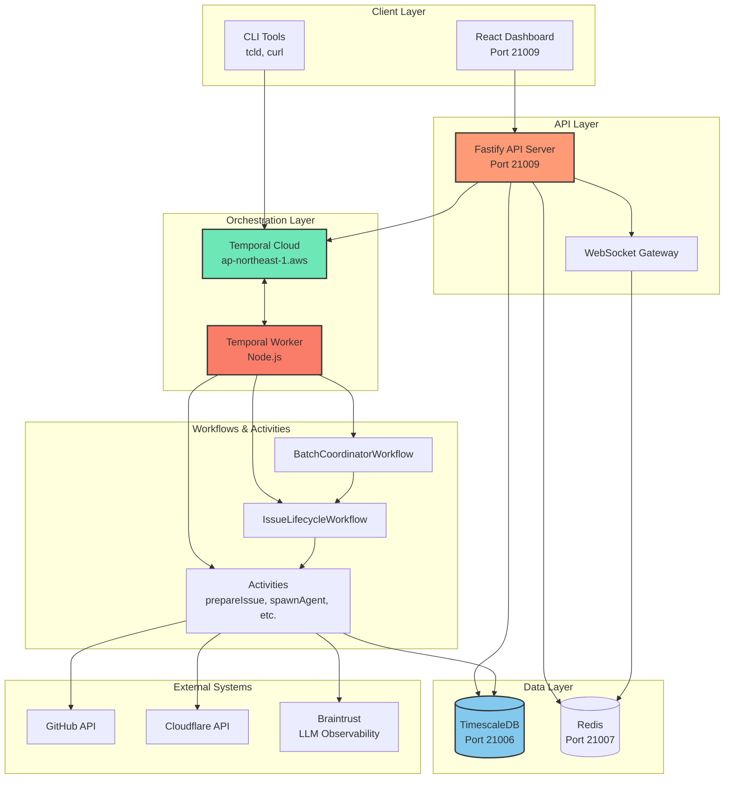
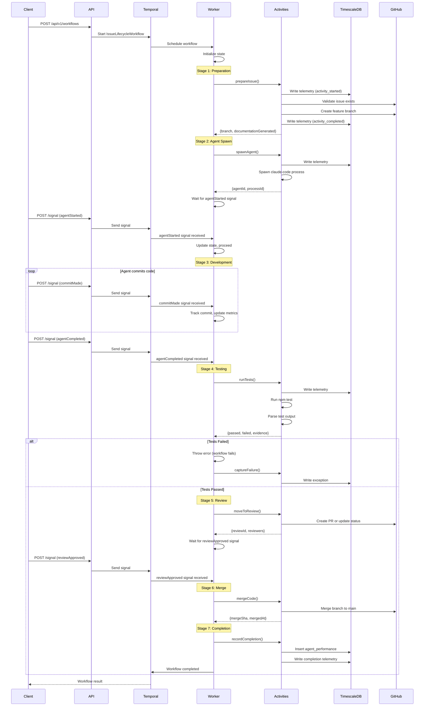
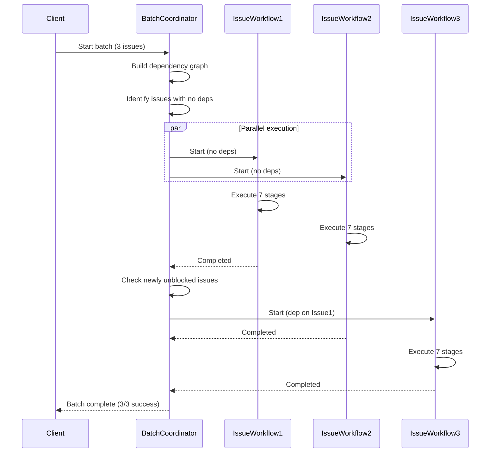
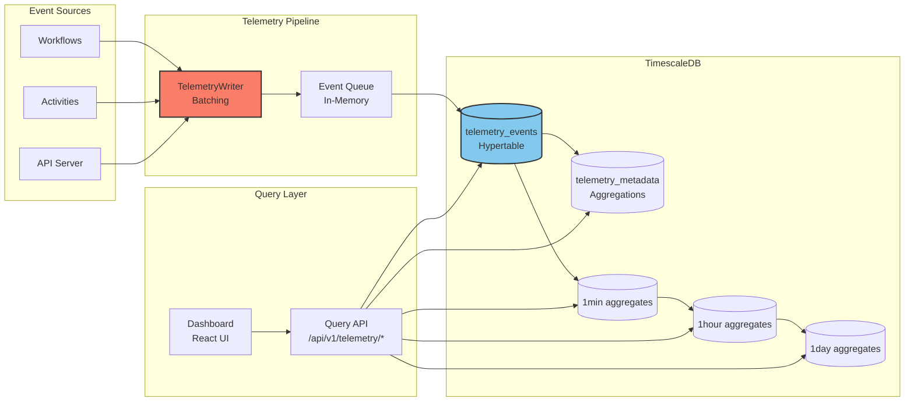
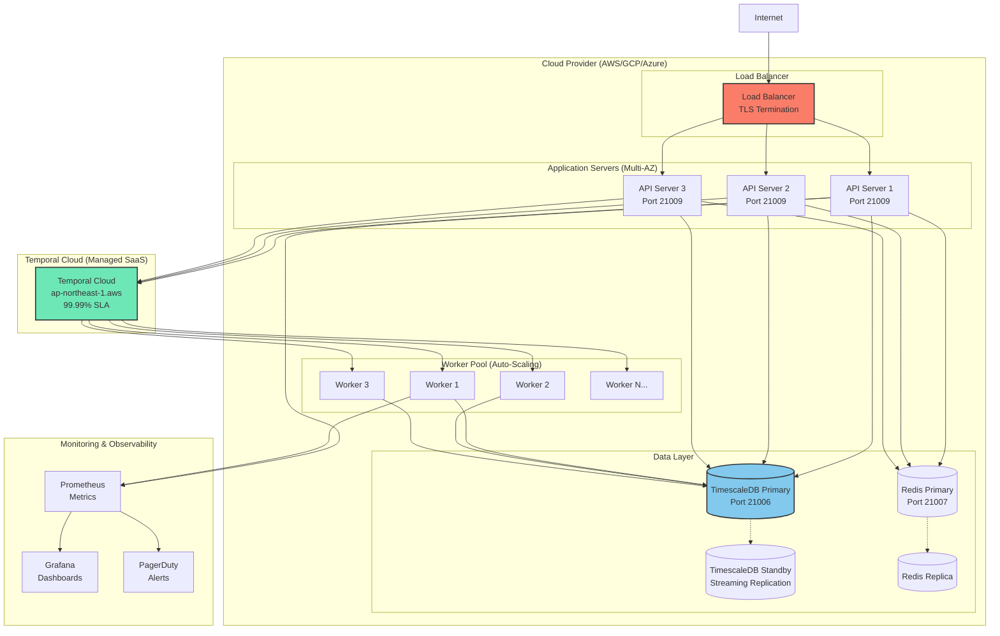
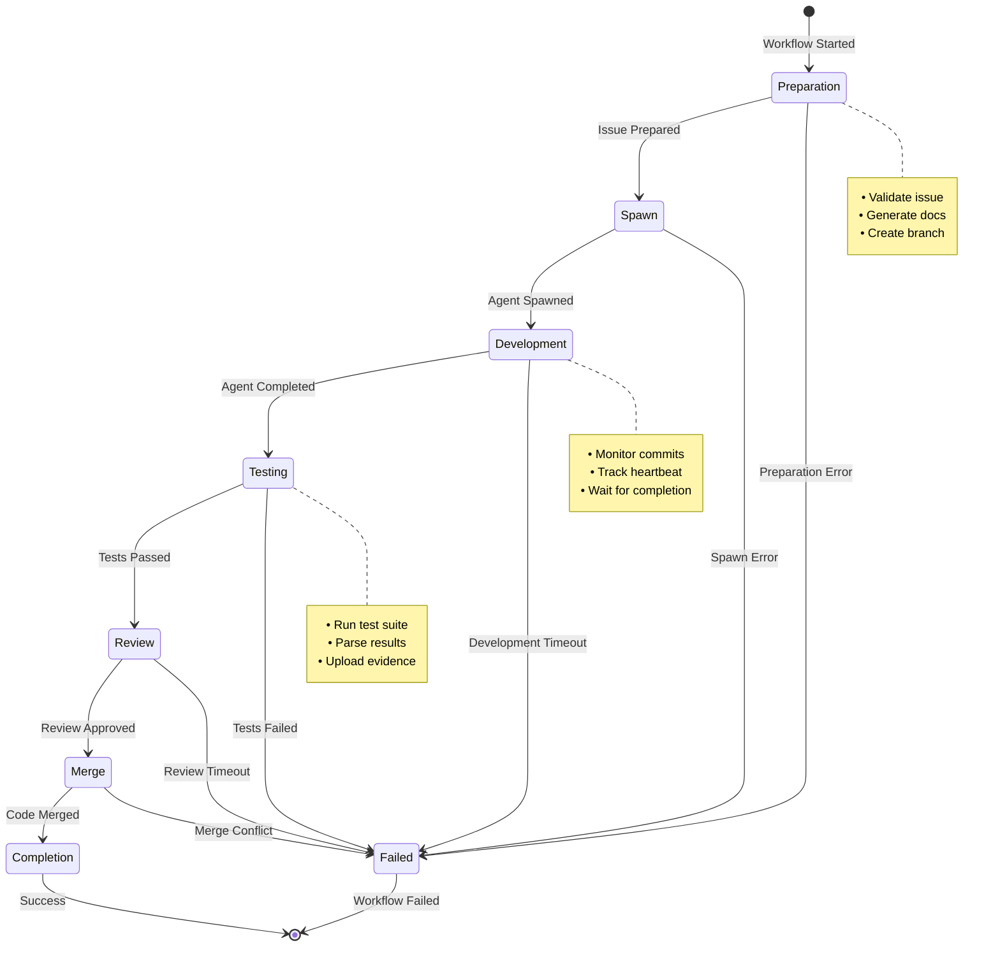

# Martha.dev v4 Platform - Architecture Diagrams

**Version:** 4.0.0
**Last Updated:** January 2026

This document contains visual diagrams of the Martha.dev v4 platform architecture using Mermaid diagrams (markdown-compatible) and ASCII art.

## Table of Contents

1. [System Architecture](#system-architecture)
2. [Workflow Execution Flow](#workflow-execution-flow)
3. [Data Flow](#data-flow)
4. [Deployment Architecture](#deployment-architecture)
5. [Issue Lifecycle State Machine](#issue-lifecycle-state-machine)

---

## System Architecture

### High-Level Component Diagram



### ASCII Component Diagram

```
┌─────────────────────────────────────────────────────────────────┐
│                         CLIENT LAYER                             │
│  ┌─────────────────┐              ┌─────────────────┐           │
│  │ React Dashboard │              │   CLI Tools     │           │
│  │   Port 21009    │              │  (tcld, curl)   │           │
│  └────────┬────────┘              └────────┬────────┘           │
└───────────┼──────────────────────────────────┼──────────────────┘
            │                                  │
┌───────────┼──────────────────────────────────┼──────────────────┐
│           ▼                API LAYER          ▼                  │
│  ┌─────────────────┐              ┌─────────────────┐           │
│  │ Fastify Server  │◄────────────►│  WebSocket GW   │           │
│  │   Port 21009    │              │                 │           │
│  └────────┬────────┘              └─────────────────┘           │
└───────────┼──────────────────────────────────────────────────────┘
            │
            │ HTTP/WS
            ▼
┌───────────────────────────────────────────────────────────────┐
│                  ORCHESTRATION LAYER                          │
│  ┌─────────────────────────┐      ┌──────────────────────┐   │
│  │    Temporal Cloud       │◄────►│  Temporal Worker     │   │
│  │  (ap-northeast-1.aws)   │      │    (Node.js)         │   │
│  │   Namespace: martha-    │      │  Task Queue: martha- │   │
│  │      dev-v4.mnjo7       │      │      tasks           │   │
│  └─────────────────────────┘      └──────────┬───────────┘   │
└─────────────────────────────────────────────────┼─────────────┘
                                                  │
                                                  │
┌─────────────────────────────────────────────────┼─────────────┐
│              WORKFLOWS & ACTIVITIES             ▼             │
│  ┌──────────────────────┐     ┌──────────────────────────┐   │
│  │ IssueLifecycle       │     │ BatchCoordinator         │   │
│  │ Workflow             │◄────┤ Workflow                 │   │
│  └──────────┬───────────┘     └──────────────────────────┘   │
│             │                                                 │
│             ▼                                                 │
│  ┌────────────────────────────────────────────────────────┐  │
│  │               Activities                                │  │
│  │  • prepareIssue    • spawnAgent    • runTests          │  │
│  │  • moveToReview    • mergeCode     • recordCompletion  │  │
│  └────────┬─────────────────────────────────┬─────────────┘  │
└───────────┼─────────────────────────────────┼────────────────┘
            │                                 │
            │ Telemetry                       │ Git/GitHub
            ▼                                 ▼
┌────────────────────────┐         ┌─────────────────────────┐
│    DATA LAYER          │         │   EXTERNAL SYSTEMS      │
│  ┌──────────────────┐  │         │  ┌──────────────────┐   │
│  │  TimescaleDB     │  │         │  │   GitHub API     │   │
│  │   Port 21006     │  │         │  └──────────────────┘   │
│  │  (Hypertables)   │  │         │  ┌──────────────────┐   │
│  └──────────────────┘  │         │  │ Cloudflare API   │   │
│  ┌──────────────────┐  │         │  └──────────────────┘   │
│  │     Redis        │  │         │  ┌──────────────────┐   │
│  │   Port 21007     │  │         │  │   Braintrust     │   │
│  │   (Pub/Sub)      │  │         │  │ (Observability)  │   │
│  └──────────────────┘  │         │  └──────────────────┘   │
└────────────────────────┘         └─────────────────────────┘
```

---

## Workflow Execution Flow

### IssueLifecycleWorkflow Execution Flow



### Batch Coordinator Flow (Simplified)



---

## Data Flow

### Telemetry Data Flow



### ASCII Data Flow Diagram

```
┌──────────────────────────────────────────────────────────────────┐
│                      EVENT SOURCES                                │
│  ┌──────────┐     ┌──────────┐     ┌──────────┐                  │
│  │Workflows │     │Activities│     │API Server│                  │
│  └────┬─────┘     └────┬─────┘     └────┬─────┘                  │
└───────┼────────────────┼────────────────┼────────────────────────┘
        │                │                │
        │   telemetry    │                │
        └────────┬───────┴────────────────┘
                 │
                 ▼
        ┌────────────────┐
        │ TelemetryWriter│
        │   (Batching)   │
        └────────┬───────┘
                 │
                 ▼
        ┌────────────────┐
        │  Event Queue   │
        │  (In-Memory)   │
        └────────┬───────┘
                 │
                 │ INSERT BATCH
                 ▼
┌────────────────────────────────────────────────────────────────┐
│                      TimescaleDB                               │
│                                                                │
│  ┌──────────────────────────────────────────────────────┐     │
│  │           telemetry_events (Hypertable)              │     │
│  │  • timestamp • workflowId • eventType • payload      │     │
│  │  • Compression: 7-day chunks                         │     │
│  │  • Retention: 90 days                                │     │
│  └──────────────────┬───────────────────────────────────┘     │
│                     │                                          │
│                     │ AUTO AGGREGATE                           │
│                     ▼                                          │
│  ┌──────────────────────────────────────────────────────┐     │
│  │        Continuous Aggregates                         │     │
│  │  ┌──────────┐  ┌──────────┐  ┌──────────┐           │     │
│  │  │  1min    │  │  1hour   │  │  1day    │           │     │
│  │  │  bucket  │  │  bucket  │  │  bucket  │           │     │
│  │  └──────────┘  └──────────┘  └──────────┘           │     │
│  └──────────────────────────────────────────────────────┘     │
│                     │                                          │
└─────────────────────┼──────────────────────────────────────────┘
                      │
                      │ SELECT queries
                      ▼
        ┌──────────────────────────┐
        │    Query API             │
        │ /api/v1/telemetry/*      │
        └──────────┬───────────────┘
                   │
                   │ HTTP/JSON
                   ▼
        ┌──────────────────────────┐
        │   React Dashboard        │
        │  • Telemetry View        │
        │  • Performance View      │
        │  • Exceptions View       │
        └──────────────────────────┘
```

---

## Deployment Architecture

### Production Deployment



### Network Diagram

```
                     INTERNET
                        │
                        │ HTTPS (443)
                        ▼
            ┌───────────────────────┐
            │   Cloudflare Tunnel   │
            │  (TLS Termination)    │
            └───────────┬───────────┘
                        │
                        │ HTTPS
                        ▼
            ┌───────────────────────┐
            │   Load Balancer       │
            │   (HAProxy/NGINX)     │
            └───────────┬───────────┘
                        │
        ┌───────────────┼───────────────┐
        │               │               │
        ▼               ▼               ▼
    ┌─────────┐   ┌─────────┐   ┌─────────┐
    │ API 1   │   │ API 2   │   │ API 3   │
    │ :21009  │   │ :21009  │   │ :21009  │
    └────┬────┘   └────┬────┘   └────┬────┘
         │             │             │
         └─────────────┼─────────────┘
                       │
         ┌─────────────┼─────────────┐
         │             │             │
         ▼             ▼             ▼
    ┌─────────────────────────────────────┐
    │      Temporal Cloud (SaaS)          │
    │  ap-northeast-1.aws.api.temporal.io │
    │            Port 7233                │
    └─────────────────┬───────────────────┘
                      │
         ┌────────────┼────────────┐
         │            │            │
         ▼            ▼            ▼
    ┌─────────┐  ┌─────────┐  ┌─────────┐
    │Worker 1 │  │Worker 2 │  │Worker N │
    └────┬────┘  └────┬────┘  └────┬────┘
         │            │            │
         └────────────┼────────────┘
                      │
         ┌────────────┼────────────┐
         │                         │
         ▼                         ▼
    ┌──────────────┐      ┌──────────────┐
    │TimescaleDB   │      │    Redis     │
    │   :21006     │      │   :21007     │
    │              │      │              │
    │  Primary     │      │  Primary     │
    │    ↕         │      │    ↕         │
    │  Standby     │      │  Replica     │
    └──────────────┘      └──────────────┘
```

---

## Issue Lifecycle State Machine

### State Transitions



### ASCII State Machine

```
                ┌─────────────┐
                │   START     │
                └──────┬──────┘
                       │
                       ▼
            ┌──────────────────┐
            │   PREPARATION    │◄────┐
            │  • Validate      │     │
            │  • Create branch │     │
            └─────────┬────────┘     │ Retry
                      │              │ (if configured)
                      ▼              │
            ┌──────────────────┐     │
            │      SPAWN       │─────┤
            │  • Select agent  │     │
            │  • Start process │     │
            └─────────┬────────┘     │
                      │              │
                      ▼              │
            ┌──────────────────┐     │
            │   DEVELOPMENT    │─────┤
            │  • Monitor       │     │
            │  • Track commits │     │
            └─────────┬────────┘     │
                      │              │
                      ▼              │
            ┌──────────────────┐     │
            │     TESTING      │─────┤
            │  • Run tests     │     │
            │  • Parse results │     │
            └─────────┬────────┘     │
                      │              │
                      ▼              │
            ┌──────────────────┐     │
            │     REVIEW       │─────┤
            │  • Create PR     │     │
            │  • Wait approval │     │
            └─────────┬────────┘     │
                      │              │
                      ▼              │
            ┌──────────────────┐     │
            │      MERGE       │─────┤
            │  • Merge code    │     │
            │  • Update status │     │
            └─────────┬────────┘     │
                      │              │
                      ▼              │
            ┌──────────────────┐     │
            │   COMPLETION     │     │
            │  • Record metrics│     │
            │  • Update DB     │     │
            └─────────┬────────┘     │
                      │              │
                      ▼              │
                ┌─────────┐          │
                │  DONE   │          │
                └─────────┘          │
                                     │
                ┌──────────────┐     │
                │   FAILED     │◄────┘
                │  (any stage) │
                └──────────────┘

Legend:
  ───► Normal flow
  ──┤  Error/retry path
```

---

## Sequence Diagrams

### Complete Issue Lifecycle (High-Level)

```
User         API         Temporal    Worker      Activities    GitHub      TimescaleDB
 │           │           │           │           │             │           │
 │  Start    │           │           │           │             │           │
 │  Workflow │           │           │           │             │           │
 ├──────────►│           │           │           │             │           │
 │           │ Start WF  │           │           │             │           │
 │           ├──────────►│           │           │             │           │
 │           │           │ Schedule  │           │             │           │
 │           │           ├──────────►│           │             │           │
 │           │           │           │           │             │           │
 │           │           │           │ Prepare   │             │           │
 │           │           │           ├──────────►│             │           │
 │           │           │           │           │ Validate    │           │
 │           │           │           │           ├────────────►│           │
 │           │           │           │           │◄────────────┤           │
 │           │           │           │           │ Write Event │           │
 │           │           │           │           ├────────────────────────►│
 │           │           │           │◄──────────┤             │           │
 │           │           │           │           │             │           │
 │           │           │           │ Spawn     │             │           │
 │           │           │           ├──────────►│             │           │
 │           │           │           │           │ Git branch  │           │
 │           │           │           │           ├────────────►│           │
 │           │           │           │◄──────────┤             │           │
 │           │           │           │           │             │           │
 │  Signal:  │           │           │           │             │           │
 │  Agent    │           │           │           │             │           │
 │  Started  │           │           │           │             │           │
 ├──────────►│           │           │           │             │           │
 │           │ Signal    │           │           │             │           │
 │           ├──────────►│           │           │             │           │
 │           │           │ Deliver   │           │             │           │
 │           │           ├──────────►│           │             │           │
 │           │           │           │ (continue)│             │           │
 │           │           │           │           │             │           │
 │  ... Development stage (commits) ...          │             │           │
 │           │           │           │           │             │           │
 │  Signal:  │           │           │           │             │           │
 │  Agent    │           │           │           │             │           │
 │  Complete │           │           │           │             │           │
 ├──────────►│           │           │           │             │           │
 │           ├──────────►│           │           │             │           │
 │           │           ├──────────►│           │             │           │
 │           │           │           │           │             │           │
 │           │           │           │ Run Tests │             │           │
 │           │           │           ├──────────►│             │           │
 │           │           │           │           │ npm test    │           │
 │           │           │           │◄──────────┤             │           │
 │           │           │           │           │             │           │
 │  Signal:  │           │           │           │             │           │
 │  Test     │           │           │           │             │           │
 │  Results  │           │           │           │             │           │
 ├──────────►│           │           │           │             │           │
 │           ├──────────►│           │           │             │           │
 │           │           ├──────────►│           │             │           │
 │           │           │           │           │             │           │
 │           │           │           │ Move to   │             │           │
 │           │           │           │ Review    │             │           │
 │           │           │           ├──────────►│             │           │
 │           │           │           │           │ Create PR   │           │
 │           │           │           │           ├────────────►│           │
 │           │           │           │◄──────────┤             │           │
 │           │           │           │           │             │           │
 │  Signal:  │           │           │           │             │           │
 │  Review   │           │           │           │             │           │
 │  Approved │           │           │           │             │           │
 ├──────────►│           │           │           │             │           │
 │           ├──────────►│           │           │             │           │
 │           │           ├──────────►│           │             │           │
 │           │           │           │           │             │           │
 │           │           │           │ Merge     │             │           │
 │           │           │           ├──────────►│             │           │
 │           │           │           │           │ git merge   │           │
 │           │           │           │           ├────────────►│           │
 │           │           │           │◄──────────┤             │           │
 │           │           │           │           │             │           │
 │           │           │           │ Record    │             │           │
 │           │           │           │ Completion│             │           │
 │           │           │           ├──────────►│             │           │
 │           │           │           │           │ Write Metrics           │
 │           │           │           │           ├────────────────────────►│
 │           │           │           │◄──────────┤             │           │
 │           │           │           │           │             │           │
 │           │           │◄──────────┤           │             │           │
 │           │◄──────────┤  Done     │           │             │           │
 │◄──────────┤           │           │           │             │           │
 │           │           │           │           │             │           │
```

---

**For more information**, see:
- System Overview: `SYSTEM_OVERVIEW.md`
- Operator Runbook: `OPERATOR_RUNBOOK.md`
- Developer Guide: `DEVELOPER_GUIDE.md`
- API Reference: `API_REFERENCE.md`
